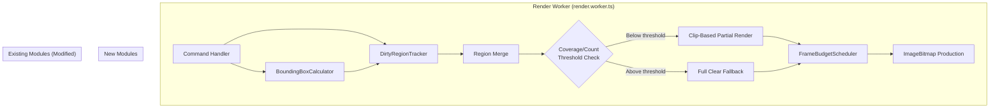
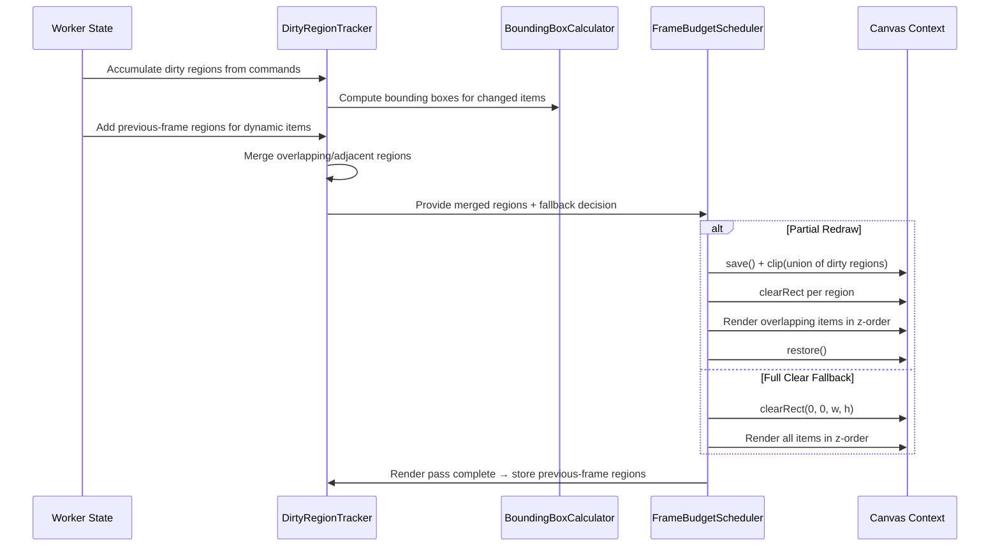

# Design Document: Dirty Rectangle Rendering

## Overview

Dirty Rectangle Rendering introduces region-based invalidation to the SlideBot render worker, replacing the current full-canvas clear-and-redraw approach with targeted partial redraws. The system computes bounding boxes for all renderable items, tracks which regions have changed between frames, merges overlapping/adjacent regions, and redraws only the affected areas — while maintaining z-order correctness by redrawing all overlapping items within each dirty region.

The design integrates with the existing `FrameBudgetScheduler` (budget enforcement still applies per-item within dirty regions), preserves the deterministic rendering order invariant, and falls back to full-canvas clearing when partial redraw overhead would exceed the cost of a full redraw.

### Key Design Decisions

1. **Pixel-space bounding boxes**: All bounding boxes and dirty regions operate in pixel coordinates (post-conversion from normalized space). This avoids repeated conversions during overlap queries and clip operations.

2. **Brute-force overlap query**: Given the bounded cache size (max 500 annotations) and typical workloads (< 100 visible items), a simple linear scan with AABB intersection is used instead of a spatial index (R-tree, grid). This avoids maintenance complexity and memory overhead while remaining well within the 2ms merge budget.

3. **Union clip path**: Rather than rendering each dirty region independently with separate save/clip/restore cycles, the system applies a single clip path that is the union of all merged dirty regions. Items that intersect any dirty region are rendered once under this combined clip. This reduces context state changes and avoids rendering the same item multiple times.

4. **Previous-frame tracking for dynamic items**: Active stroke, live strokes, and lasers change every frame. Their previous-frame bounding boxes are stored and automatically added as dirty regions in the next frame to ensure proper clearing.

5. **Graceful fallback**: When dirty region count or coverage exceeds thresholds, the system falls back to the existing full-canvas render path with zero behavioral change.

## Architecture



### Data Flow Per Frame



## Components and Interfaces

### BoundingBoxCalculator (`boundingBoxCalculator.ts` — new file)

A stateless utility module that computes pixel-space bounding boxes for all annotation types.

```typescript
/** Axis-aligned bounding box in pixel coordinates. */
export interface BoundingBox {
  x: number;
  y: number;
  width: number;
  height: number;
}

/** Viewport dimensions for coordinate conversion. */
export interface ViewportDimensions {
  viewportWidth: number;
  viewportHeight: number;
}

/**
 * Compute bounding box for a committed annotation.
 * Handles freehand, highlight, arrow, and text tools.
 */
export function computeAnnotationBBox(
  annotation: SerializedAnnotation,
  viewport: ViewportDimensions,
  ctx?: OffscreenCanvasRenderingContext2D, // needed for text measurement
): BoundingBox;

/**
 * Compute bounding box for a freehand-style point array.
 * Used for active strokes, live strokes, and freehand annotations.
 * Expands by half strokeWidth on each side.
 */
export function computePointsBBox(
  points: Float64Array,
  strokeWidthPx: number,
  viewport: ViewportDimensions,
): BoundingBox;

/**
 * Compute bounding box for a laser trail.
 * Expands by laser head radius (6px) on each side.
 */
export function computeLaserBBox(
  trail: Float64Array,
  viewport: ViewportDimensions,
): BoundingBox;

/**
 * Compute bounding box for an arrow annotation.
 * Includes arrowhead triangle vertices.
 */
export function computeArrowBBox(
  startX: number, startY: number,
  endX: number, endY: number,
  strokeWidthPx: number,
  viewport: ViewportDimensions,
): BoundingBox;

/**
 * Clamp a bounding box to viewport boundaries.
 * Ensures x >= 0, y >= 0, x+width <= viewportWidth, y+height <= viewportHeight.
 */
export function clampToViewport(
  bbox: BoundingBox,
  viewport: ViewportDimensions,
): BoundingBox;
```

### DirtyRegionTracker (`dirtyRegionTracker.ts` — new file)

Manages dirty region accumulation, merging, previous-frame tracking, and fallback decisions.

```typescript
/** Configuration for dirty rectangle behavior. */
export interface DirtyRectConfig {
  enabled: boolean;
  coverageThreshold: number;   // 0.1–1.0, default 0.6
  regionCountThreshold: number; // 1–64, default 16
  mergeMargin: number;          // 0–32 pixels, default 4
}

/** Result of preparing dirty regions for a frame. */
export interface DirtyFrameResult {
  /** Whether to use full-clear fallback. */
  useFullClear: boolean;
  /** Merged dirty regions (empty if useFullClear is true). */
  regions: BoundingBox[];
  /** Total dirty area in pixels. */
  totalDirtyArea: number;
  /** Coverage ratio (dirty area / canvas area). */
  coverageRatio: number;
}

export class DirtyRegionTracker {
  constructor(config?: Partial<DirtyRectConfig>);

  /** Mark a bounding box as dirty for the current frame. */
  markDirty(bbox: BoundingBox): void;

  /** Mark the entire canvas as dirty (triggers full clear next frame). */
  invalidateAll(): void;

  /**
   * Prepare dirty regions for rendering.
   * Adds previous-frame regions for dynamic items, merges all regions,
   * evaluates fallback thresholds, and returns the frame decision.
   */
  prepareFrame(
    viewport: ViewportDimensions,
    activeStrokeBBox: BoundingBox | null,
    liveStrokeBBoxes: Map<string, BoundingBox>,
    laserBBoxes: Map<string, BoundingBox>,
  ): DirtyFrameResult;

  /**
   * Called after a render pass completes.
   * Stores current dynamic item bounding boxes as previous-frame regions.
   * Clears accumulated dirty regions.
   */
  commitFrame(
    activeStrokeBBox: BoundingBox | null,
    liveStrokeBBoxes: Map<string, BoundingBox>,
    laserBBoxes: Map<string, BoundingBox>,
  ): void;

  /** Handle removal of a live stroke — marks previous region dirty. */
  onLiveStrokeRemoved(userId: string): void;

  /** Handle removal of a laser — marks previous region dirty. */
  onLaserRemoved(userId: string): void;

  /** Handle active stroke commit/cancel — marks previous region dirty. */
  onActiveStrokeEnded(): void;

  /** Handle resize — invalidates all, clears previous-frame regions. */
  onResize(): void;

  /** Handle slide change — invalidates all, clears previous-frame regions. */
  onSlideChange(): void;

  /** Update configuration. Returns error message or null on success. */
  setConfig(partial: Partial<DirtyRectConfig>): string | null;

  /** Get current configuration. */
  getConfig(): Readonly<DirtyRectConfig>;

  /** Get metrics for the current frame (called after prepareFrame). */
  getFrameMetrics(): { regionCount: number; totalDirtyArea: number; coverageRatio: number; usedFullClear: boolean };
}
```

### Region Merging Algorithm

The merge algorithm uses an iterative union-find approach:

```
function mergeRegions(regions: BoundingBox[], mergeMargin: number): BoundingBox[]
  1. Copy input regions into a mutable working list
  2. Repeat:
     a. Set merged = false
     b. For each pair (i, j) where i < j:
        - If regions[i] overlaps or is within mergeMargin of regions[j]:
          - Replace regions[i] with the union bounding box of both
          - Remove regions[j]
          - Set merged = true
          - Restart inner loop (break to step 2)
     c. If merged == false, break (no more merges possible)
  3. Return the remaining regions
```

Two regions are "within merge margin" when:
- The gap on the X-axis between them is ≤ mergeMargin, AND
- The gap on the Y-axis between them is ≤ mergeMargin

This is O(n²) per pass with at most n passes, giving O(n³) worst case. For n ≤ 64 input regions, this completes well within the 2ms budget.

### Overlap Query

Given a set of dirty regions, find all renderable items that intersect any of them:

```typescript
/**
 * Find all annotations whose bounding box intersects any dirty region.
 * Returns annotation IDs in insertion order (for z-order rendering).
 */
function findOverlappingAnnotations(
  cache: WorkerAnnotationCache,
  regions: BoundingBox[],
  viewport: ViewportDimensions,
  ctx?: OffscreenCanvasRenderingContext2D,
): SerializedAnnotation[];
```

Implementation: Linear scan over all cached annotations, computing each annotation's bounding box and testing AABB intersection against each dirty region. An annotation is included if it intersects any region. The result preserves insertion order from the cache.

AABB intersection test:
```
function intersects(a: BoundingBox, b: BoundingBox): boolean {
  return a.x < b.x + b.width &&
         a.x + a.width > b.x &&
         a.y < b.y + b.height &&
         a.y + a.height > b.y;
}
```

### Integration with FrameBudgetScheduler

The `executeBudgetedRender` method is modified to accept an optional `DirtyFrameResult`:

```typescript
// New parameter added to executeBudgetedRender signature:
executeBudgetedRender(
  state: BudgetRenderState,
  renderFns: RenderFunctions,
  dirtyFrame?: DirtyFrameResult, // NEW: dirty region info
): BudgetedRenderResult;
```

**Behavior when `dirtyFrame` is provided and `useFullClear === false`:**
1. Save canvas state
2. Build a clip path from the union of all dirty regions (series of `rect()` calls)
3. Apply clip
4. Clear only within each dirty region (`clearRect` per region)
5. Render overlapping items in z-order with budget enforcement
6. Restore canvas state

**Behavior when `dirtyFrame` is not provided or `useFullClear === true`:**
- Existing full-canvas clear-and-redraw behavior (unchanged)

### New Command: SET_DIRTY_RECT_CONFIG

Added to the `RenderCommand` union type:

```typescript
| { type: 'SET_DIRTY_RECT_CONFIG'; config: Partial<DirtyRectConfigInput> }
```

Where `DirtyRectConfigInput` is:
```typescript
interface DirtyRectConfigInput {
  enabled?: boolean;
  coverageThreshold?: number;   // 0.1–1.0
  regionCountThreshold?: number; // 1–64
  mergeMargin?: number;          // 0–32
}
```

New response type:
```typescript
| { type: 'DIRTY_RECT_CONFIG_ERROR'; message: string }
| { type: 'DIRTY_RECT_CONFIG_UPDATED'; config: DirtyRectConfig }
```

### Metrics Extension

Extended `FrameMetricsEntry`:
```typescript
export interface FrameMetricsEntry {
  // ... existing fields ...
  /** Dirty rectangle metrics for this frame. */
  dirtyRect?: {
    regionCount: number;
    totalDirtyArea: number;
    coverageRatio: number;
    usedFullClear: boolean;
  };
}
```

Extended `MetricsResponse`:
```typescript
export interface MetricsResponse {
  // ... existing fields ...
  /** Dirty rectangle statistics over the rolling window. */
  dirtyRect: {
    regionCount: { avgMs: number; p95Ms: number; maxMs: number };
    totalDirtyArea: { avgMs: number; p95Ms: number; maxMs: number };
    coverageRatio: { avgMs: number; p95Ms: number; maxMs: number };
    fullClearCount: number;
    partialRedrawRatio: number; // 0.0–1.0
  };
}
```

## Data Models

### BoundingBox

```typescript
interface BoundingBox {
  x: number;      // Left edge in pixels (>= 0)
  y: number;      // Top edge in pixels (>= 0)
  width: number;  // Width in pixels (>= 0)
  height: number; // Height in pixels (>= 0)
}
```

### DirtyRectConfig

```typescript
interface DirtyRectConfig {
  enabled: boolean;              // Default: true
  coverageThreshold: number;     // Default: 0.6, range [0.1, 1.0]
  regionCountThreshold: number;  // Default: 16, range [1, 64]
  mergeMargin: number;           // Default: 4, range [0, 32]
}
```

### PreviousFrameRegions

```typescript
interface PreviousFrameRegions {
  activeStroke: BoundingBox | null;
  liveStrokes: Map<string, BoundingBox>;  // keyed by userId
  lasers: Map<string, BoundingBox>;       // keyed by userId
}
```

### DirtyRegionDeferredWork (extension to existing DeferredWork)

```typescript
interface DirtyRegionDeferredWork extends DeferredWork {
  /** Index into the merged dirty regions list where rendering should resume. */
  dirtyRegionResumeIndex: number;
  /** Item index within the current dirty region where rendering should resume. */
  itemResumeIndex: number;
  /** The merged dirty regions for this deferred render pass. */
  dirtyRegions: BoundingBox[];
  /** The overlapping items list for the current region. */
  overlappingItems: SerializedAnnotation[];
}
```

### FrameMetricsEntry Extension

```typescript
interface DirtyRectMetrics {
  regionCount: number;       // Number of merged dirty regions
  totalDirtyArea: number;    // Total dirty area in pixels
  coverageRatio: number;     // Ratio of dirty area to canvas area
  usedFullClear: boolean;    // Whether full-clear fallback was triggered
}
```


## Correctness Properties

*A property is a characteristic or behavior that should hold true across all valid executions of a system — essentially, a formal statement about what the system should do. Properties serve as the bridge between human-readable specifications and machine-verifiable correctness guarantees.*

### Property 1: Point-array bounding box encloses all points with padding

*For any* Float64Array of valid normalized coordinate pairs (length ≥ 4), any positive expansion radius (strokeWidth/2 or laser radius), and any viewport dimensions, the computed bounding box SHALL contain every point (converted to pixel space) with at least the expansion radius of clearance on each side.

**Validates: Requirements 1.1, 1.5, 1.6, 1.7**

### Property 2: Highlight bounding box equals pixel-converted rectangle

*For any* highlight annotation with (x, y, width, height) in normalized [0,1] space and any viewport dimensions, the computed bounding box SHALL equal (x × viewportWidth, y × viewportHeight, width × viewportWidth, height × viewportHeight) after viewport clamping.

**Validates: Requirements 1.2**

### Property 3: Arrow bounding box encloses line and arrowhead geometry

*For any* arrow annotation with start/end points in normalized space, any strokeWidth, and any viewport dimensions, the computed bounding box SHALL contain the pixel-space start point, end point, and both arrowhead triangle tip vertices (at ±30° from line angle, length = max(strokeWidth×3, 10)), each with at least half-strokeWidth clearance.

**Validates: Requirements 1.3**

### Property 4: Bounding box viewport clamping invariant

*For any* computed bounding box and any viewport dimensions, the clamped result SHALL satisfy: x ≥ 0, y ≥ 0, x + width ≤ viewportWidth, y + height ≤ viewportHeight, width ≥ 0, and height ≥ 0.

**Validates: Requirements 1.9, 1.10**

### Property 5: Cache mutations mark affected bounding boxes as dirty

*For any* annotation added to, removed from, or modified in the cache, the dirty region set for the current frame SHALL contain the bounding box(es) of the affected annotation (both old and new bbox for modifications).

**Validates: Requirements 2.1, 2.2, 2.3**

### Property 6: Dynamic items contribute current and previous bounding boxes to dirty regions

*For any* frame where dynamic items (active stroke, live strokes, lasers) exist, the prepared dirty regions SHALL include both the current bounding box of each dynamic item AND its stored previous-frame bounding box (if one exists).

**Validates: Requirements 2.4, 2.5, 2.6, 2.7, 2.8, 2.9**

### Property 7: Previous-frame regions stored after render pass completion

*For any* completed render pass with dynamic items, calling commitFrame SHALL store the current bounding box of each dynamic item as its previous-frame region, and the next call to prepareFrame SHALL include those stored regions in the dirty set.

**Validates: Requirements 7.1, 7.2, 7.3**

### Property 8: Dynamic item removal marks previous region dirty and removes entry

*For any* dynamic item (live stroke, laser, or active stroke) that has a stored previous-frame region, removing that item SHALL mark the stored bounding box as a dirty region AND remove the entry from previous-frame tracking.

**Validates: Requirements 7.4, 7.5, 7.6**

### Property 9: Region merge post-condition — no mergeable pairs remain

*For any* set of input dirty regions and any merge margin ≥ 0, after the merge algorithm completes, no pair of regions in the output SHALL overlap or have an edge-to-edge distance ≤ merge margin on both axes simultaneously.

**Validates: Requirements 3.1, 3.2, 3.3**

### Property 10: Overlap query returns exactly intersecting items in z-order

*For any* set of cached annotations and any set of dirty regions, the overlap query SHALL return exactly those annotations whose bounding box intersects at least one dirty region, in insertion order (oldest-to-newest), with live strokes ordered by userId ascending, lasers ordered by userId ascending, and active stroke last.

**Validates: Requirements 4.1, 4.2, 10.2**

### Property 11: Coverage ratio exceeding threshold triggers full clear

*For any* set of merged dirty regions whose total area divided by canvas area is strictly greater than the configured coverage threshold, prepareFrame SHALL return useFullClear = true.

**Validates: Requirements 5.1**

### Property 12: Region count exceeding threshold triggers full clear

*For any* set of merged dirty regions whose count is strictly greater than the configured region count threshold, prepareFrame SHALL return useFullClear = true.

**Validates: Requirements 5.2**

### Property 13: Full clear resets all tracking state

*For any* frame where full clear fallback is triggered, after the render pass completes the dirty region tracker SHALL have zero accumulated dirty regions and zero previous-frame region entries.

**Validates: Requirements 5.4**

### Property 14: Resize clears previous-frame regions and triggers full clear

*For any* stored previous-frame regions, calling onResize SHALL clear all previous-frame region entries and cause the next prepareFrame to return useFullClear = true.

**Validates: Requirements 8.1, 8.3**

### Property 15: Valid partial config updates only specified fields

*For any* partial configuration with all values within valid ranges, calling setConfig SHALL update only the specified fields and leave all unspecified fields at their previous values.

**Validates: Requirements 9.1**

### Property 16: Invalid config values reject entire command

*For any* partial configuration containing at least one value outside the accepted range (coverageThreshold outside [0.1, 1.0], regionCountThreshold outside [1, 64], or mergeMargin outside [0, 32]), setConfig SHALL return an error message and leave all configuration values unchanged.

**Validates: Requirements 9.2**

### Property 17: Disabled dirty rect always uses full clear

*For any* frame when the dirty rect system is disabled (enabled = false), prepareFrame SHALL return useFullClear = true regardless of the number or area of dirty regions.

**Validates: Requirements 9.4**

### Property 18: Invalid regions trigger full clear fallback

*For any* dirty region with negative width, negative height, NaN coordinates, or Infinity coordinates, the dirty region tracker SHALL discard the invalid region and trigger a full clear fallback for that frame.

**Validates: Requirements 10.4**

## Error Handling

### Invalid Bounding Box Detection

When `BoundingBoxCalculator` produces a bounding box with NaN, Infinity, or negative dimensions (due to corrupted input data), the `DirtyRegionTracker` detects this in `markDirty()`:
- Logs a warning: `[DirtyRegionTracker] Invalid region detected: {bbox}. Triggering full clear.`
- Discards the invalid region
- Sets an internal flag to force full clear on the next `prepareFrame()` call

### Empty Point Arrays

When a Float64Array has fewer than 2 coordinate values (fewer than 1 point):
- `computePointsBBox` returns `{ x: 0, y: 0, width: 0, height: 0 }`
- `markDirty` expands zero-area regions to 1×1 minimum before adding

### Configuration Validation Errors

When `SET_DIRTY_RECT_CONFIG` contains invalid values:
- The entire command is rejected atomically (no partial application)
- A `DIRTY_RECT_CONFIG_ERROR` response is posted with a message listing which fields are out of range
- Example: `"Invalid config: coverageThreshold (1.5) must be in [0.1, 1.0], mergeMargin (50) must be in [0, 32]"`

### Canvas Context Failures

If `ctx.save()`, `ctx.clip()`, or `ctx.restore()` throw (extremely rare in OffscreenCanvas):
- Catch the error, log it
- Fall back to full-canvas clear for the current frame
- Reset clip state by creating a fresh context state

### ImageBitmap Production Failure

If `createImageBitmap` fails after a dirty-rect render pass:
- The existing error handling in `FrameBudgetScheduler.scheduleFrame()` applies (logs error, continues scheduling)
- No special dirty-rect handling needed

## Testing Strategy

### Property-Based Tests (using fast-check)

The project uses TypeScript with Vitest. Property-based tests will use the `fast-check` library.

**Configuration:**
- Minimum 100 iterations per property test
- Each test tagged with: `Feature: dirty-rectangle-rendering, Property {N}: {title}`

**Test files:**
- `boundingBoxCalculator.property.test.ts` — Properties 1–4
- `dirtyRegionTracker.property.test.ts` — Properties 5–8, 11–14, 17–18
- `regionMerge.property.test.ts` — Property 9
- `overlapQuery.property.test.ts` — Property 10
- `dirtyRectConfig.property.test.ts` — Properties 15–16

**Generators needed:**
- `arbFloat64Points(minPairs, maxPairs)` — generates valid Float64Arrays of normalized [0,1] coordinate pairs
- `arbViewport()` — generates viewport dimensions (100–4000 px)
- `arbStrokeWidth()` — generates stroke widths (0.5–20 px)
- `arbBoundingBox(viewport)` — generates valid bounding boxes within viewport
- `arbSerializedAnnotation(viewport)` — generates random annotations of all tool types
- `arbDirtyRectConfig()` — generates valid and invalid config objects
- `arbInvalidBoundingBox()` — generates bboxes with NaN, Infinity, negative dimensions

### Unit Tests (example-based)

- Text bounding box computation with mocked `ctx.measureText` (Req 1.4)
- RESIZE/SLIDE_CHANGE event handling (Req 2.10, 2.11)
- Clip region save/restore sequence verification with mocked canvas context (Req 4.4, 4.5)
- Empty dirty region clearing (Req 4.6)
- Budget enforcement within dirty regions (Req 6.1–6.6)
- Frame skip when no dirty regions (Req 10.3)
- First frame full clear (Req 10.5)
- Metrics recording and aggregation (Req 11.1–11.3)
- Config applied on next frame, not current (Req 9.3)
- Re-enable triggers full clear for first frame (Req 9.5)

### Integration Tests

- End-to-end render pass: send commands through the worker message handler, verify frame production with dirty-rect metrics
- Deferred work across follow-up frames with dirty regions
- Performance benchmark: merge 64 regions within 2ms (Req 3.6)
