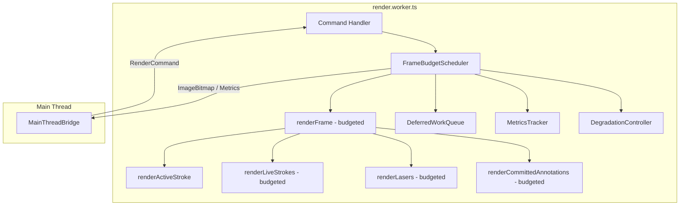

# Design Document: Frame Budget Scheduler

## Overview

The Frame Budget Scheduler introduces time-aware render scheduling to the SlideBot render worker (`render.worker.ts`). It wraps the existing `renderFrame()` logic with a budget enforcement layer that measures elapsed time during each render pass and defers lower-priority items to subsequent frames when the configured budget (default 6ms) is exceeded.

The scheduler complements the existing `DegradationController` (which reduces frame rate and disables smoothing under load) by preventing individual frames from taking too long — ensuring the browser's compositor and input handling remain responsive even with hundreds of annotations on screen.

### Key Design Decisions

1. **In-worker implementation**: The scheduler lives entirely within `render.worker.ts`, avoiding cross-thread coordination overhead.
2. **Category-level granularity**: Budget checks happen after each item within a category, not at arbitrary points. This keeps the implementation simple and predictable.
3. **Progressive rendering with full canvas clear**: Each frame (including follow-ups) clears the canvas and redraws from scratch. This avoids complex dirty-region tracking at the cost of redrawing already-rendered items.
4. **Zero-delay follow-up frames**: When work is deferred, the next frame is scheduled immediately (setTimeout 0) rather than waiting for the normal frame interval, ensuring deferred content appears as quickly as possible.

## Architecture



The scheduler sits between the command handler and the render functions. It:
1. Receives the "render" signal (dirty flag + schedule trigger)
2. Records start time
3. Calls render functions in priority order, passing a budget context
4. After each item in a budget-checked category, checks elapsed time
5. When budget is exceeded, records remaining work as deferred
6. Produces an ImageBitmap regardless of completeness
7. Schedules a follow-up frame if deferred work exists

## Components and Interfaces

### FrameBudgetScheduler

The core scheduling component. Replaces the current `scheduleFrame()` / `produceFrame()` / `renderFrame()` pipeline.

```typescript
interface FrameBudgetConfig {
  /** Frame budget in milliseconds. Default 6. Range [1, 16]. */
  budgetMs: number;
  /** Maximum consecutive follow-up frames before forced completion. */
  maxFollowUpFrames: number; // default 10
}

interface DeferredWork {
  /** Remaining live strokes (by userId) not yet rendered. */
  liveStrokes: string[];
  /** Remaining laser userIds not yet rendered. */
  lasers: string[];
  /** Index into the reversed annotation list where rendering should resume. */
  committedAnnotationResumeIndex: number;
  /** Total committed annotations count at time of deferral. */
  committedAnnotationTotal: number;
}

interface CategoryTiming {
  activeStrokeMs: number;
  liveStrokesMs: number;
  lasersMs: number;
  committedAnnotationsMs: number;
}

class FrameBudgetScheduler {
  private config: FrameBudgetConfig;
  private deferredWork: DeferredWork | null;
  private followUpCount: number;
  private metricsTracker: MetricsTracker;
  private getNow: () => number; // performance.now() or Date.now() fallback

  constructor(config?: Partial<FrameBudgetConfig>);

  /** Entry point: schedule the next frame (normal or follow-up). */
  scheduleFrame(state: InternalWorkerState): void;

  /** Execute a budgeted render pass. Returns whether work was deferred. */
  executeBudgetedRender(state: InternalWorkerState): boolean;

  /** Update the frame budget. Returns error message if invalid. */
  setFrameBudget(value: unknown): string | null;

  /** Discard all deferred work and cancel pending follow-ups. */
  discardDeferredWork(): void;

  /** Get current metrics snapshot. */
  getMetrics(): MetricsResponse;

  /** Check if there is pending deferred work. */
  hasDeferredWork(): boolean;
}
```

### MetricsTracker

Maintains the rolling window of frame timing measurements.

```typescript
interface FrameMetricsEntry {
  categoryTimings: CategoryTiming;
  totalDurationMs: number;
  budgetUtilization: number; // totalDurationMs / budgetMs
  hadDeferral: boolean;
}

interface MetricsResponse {
  perCategory: {
    [K in keyof CategoryTiming]: {
      avgMs: number;
      p95Ms: number;
      maxMs: number;
    };
  };
  overallBudgetUtilization: number; // average across window
  deferredFrameCount: number;
  windowSize: number; // current entries (may be < 60)
}

class MetricsTracker {
  private window: FrameMetricsEntry[];
  private readonly maxWindowSize: number; // 60

  constructor();

  /** Record a frame's timing data. Evicts oldest if at capacity. */
  record(entry: FrameMetricsEntry): void;

  /** Compute statistics over the current window. */
  computeStats(): MetricsResponse;
}
```

### TimingContext

A lightweight object passed through the render pass to track elapsed time.

```typescript
interface TimingContext {
  readonly startTime: number;
  readonly budgetMs: number;
  readonly forceComplete: boolean; // true when follow-up count exceeds max

  /** Returns elapsed time since start in ms. */
  elapsed(): number;

  /** Returns true if elapsed time exceeds budget. */
  isOverBudget(): boolean;
}
```

### New RenderCommand Types

Two new command types are added to the `RenderCommand` union:

```typescript
// Added to RenderCommand union
| { type: 'SET_FRAME_BUDGET'; value: number }
| { type: 'GET_METRICS' }
```

A new response type is added:

```typescript
// Added to WorkerResponse union
| { type: 'METRICS'; data: MetricsResponse }
| { type: 'BUDGET_ERROR'; message: string }
| { type: 'BUDGET_UPDATED'; value: number }
```

### Content-Affecting Command Classification

Commands that modify renderable state and trigger deferred work invalidation:

- `ANNOTATION_UPDATE`
- `ANNOTATION_REMOVE`
- `SLIDE_CHANGE`
- `LIVE_STROKE_UPDATE`
- `LIVE_STROKE_COMMIT`
- `LIVE_STROKE_REMOVE`
- `ACTIVE_STROKE_START`
- `ACTIVE_STROKE_POINTS`
- `ACTIVE_STROKE_COMMIT`
- `ACTIVE_STROKE_CANCEL`
- `LASER_UPDATE`
- `LASER_REMOVE`

Commands that do NOT invalidate deferred work:

- `INIT`, `RESIZE`, `TERMINATE`
- `SET_DEGRADATION_MODE`
- `SET_FRAME_BUDGET`, `GET_METRICS`
- `HIT_TEST`
- `REPLAY_START`, `REPLAY_SEEK`, `REPLAY_STOP`

## Data Models

### Scheduler State (added to InternalWorkerState)

```typescript
interface InternalWorkerState {
  // ... existing fields ...
  scheduler: FrameBudgetScheduler;
}
```

### DeferredWork Tracking

The deferred work is tracked as a simple cursor into the render categories:

```typescript
// For Live_Strokes and Lasers: array of remaining userIds
// For Committed_Annotations: an index into the reversed cache array

interface DeferredWork {
  liveStrokes: string[];       // remaining userId keys
  lasers: string[];            // remaining userId keys
  committedAnnotationResumeIndex: number; // 0 = nothing deferred, N = resume from Nth item
  committedAnnotationTotal: number;       // snapshot of cache size at deferral time
}
```

### Rolling Window Entry

```typescript
interface FrameMetricsEntry {
  categoryTimings: {
    activeStrokeMs: number;
    liveStrokesMs: number;
    lasersMs: number;
    committedAnnotationsMs: number;
  };
  totalDurationMs: number;
  budgetUtilization: number;
  hadDeferral: boolean;
}
```

## Correctness Properties

*A property is a characteristic or behavior that should hold true across all valid executions of a system — essentially, a formal statement about what the system should do. Properties serve as the bridge between human-readable specifications and machine-verifiable correctness guarantees.*

### Property 1: Budget enforcement causes deferral

*For any* set of render items across budget-checked categories (Live_Strokes, Lasers, Committed_Annotations) and any frame budget, if the cumulative render time exceeds the budget after drawing item N in a category, then items N+1 through the end of that category and all items in lower-priority categories SHALL be marked as deferred work.

**Validates: Requirements 1.3, 1.4, 1.5, 1.6, 1.7, 1.8, 1.9, 2.3, 2.4**

### Property 2: Priority ordering invariant

*For any* render pass, the scheduler SHALL invoke render functions in the fixed order: Active_Stroke, then Live_Strokes, then Lasers, then Committed_Annotations. No category shall be rendered before a higher-priority category.

**Validates: Requirements 2.1**

### Property 3: Active stroke always completes

*For any* active stroke of any complexity, the scheduler SHALL render it in its entirety regardless of the frame budget state. If the active stroke alone exceeds the budget, all remaining categories SHALL be deferred.

**Validates: Requirements 2.2, 8.1**

### Property 4: Committed annotations newest-first order

*For any* set of committed annotations in the cache, the scheduler SHALL render them in descending insertion order (newest first). When resuming in a follow-up frame, rendering continues from the next unrendered annotation in the same order.

**Validates: Requirements 2.5, 7.1, 7.2**

### Property 5: Follow-up frame scheduling

*For any* render pass that produces deferred work, the scheduler SHALL schedule a follow-up frame with zero delay. When no deferred work remains, the scheduler SHALL return to the normal frame interval from the DegradationController.

**Validates: Requirements 3.1, 3.3**

### Property 6: Resumption correctness

*For any* deferral point within a render pass, the subsequent follow-up frame SHALL resume rendering from the exact item where the previous frame stopped, maintaining category priority order and the same budget enforcement.

**Validates: Requirements 3.2, 7.2**

### Property 7: Content-affecting command invalidates deferred work

*For any* content-affecting RenderCommand (commands that modify renderable state, excluding GET_METRICS, SET_FRAME_BUDGET, HIT_TEST, RESIZE, SET_DEGRADATION_MODE) arriving while deferred work exists, the scheduler SHALL discard all deferred work and trigger a fresh full render pass.

**Validates: Requirements 3.4**

### Property 8: Convergence guarantee

*For any* amount of deferred work, if the number of consecutive follow-up frames for a single render cycle exceeds 10, the scheduler SHALL render all remaining deferred work in the next frame regardless of budget, guaranteeing that all content is eventually rendered.

**Validates: Requirements 3.6**

### Property 9: Canvas clear on every frame

*For any* frame produced by the scheduler (normal or follow-up), the canvas SHALL be fully cleared via `clearRect` before any rendering begins.

**Validates: Requirements 6.2**

### Property 10: Behavioral equivalence when within budget

*For any* set of render items where the total render time does not exceed the frame budget, the scheduler SHALL render all items in every category, producing the same visual output as the unbounded render loop.

**Validates: Requirements 6.3**

### Property 11: Rolling window bounded at 60 entries

*For any* sequence of rendered frames, the metrics rolling window SHALL contain at most 60 entries. When a new entry is added to a full window, the oldest entry SHALL be evicted.

**Validates: Requirements 4.3**

### Property 12: Metrics statistics correctness

*For any* rolling window of frame timing entries, the computed statistics (average, p95, max per category, overall budget utilization average, deferred frame count) SHALL be mathematically correct over the entries in the window.

**Validates: Requirements 4.4, 4.5, 4.6**

### Property 13: Budget validation

*For any* value passed to SET_FRAME_BUDGET: if the value is a finite number in [1, 16], the budget SHALL be updated to that value; otherwise the budget SHALL remain unchanged and an error SHALL be returned.

**Validates: Requirements 5.1, 5.2, 5.4**

### Property 14: Slide change discards deferred work

*For any* SLIDE_CHANGE command, the scheduler SHALL discard all deferred work from the previous slide and cancel any pending follow-up frames, regardless of how much deferred work remains.

**Validates: Requirements 8.5**

### Property 15: Frame production invariant

*For any* render pass (normal or follow-up, complete or partial), the scheduler SHALL produce an ImageBitmap and transfer it to the main thread.

**Validates: Requirements 3.5**

## Error Handling

| Scenario | Handling |
|----------|----------|
| `performance.now()` unavailable | Detect once at worker init; fall back to `Date.now()` |
| `SET_FRAME_BUDGET` with invalid value | Return `BUDGET_ERROR` response; retain current budget |
| `createImageBitmap` failure | Log error, mark dirty for retry on next frame (existing behavior) |
| Empty render categories | Skip with negligible overhead (< 0.1ms) |
| Follow-up frame count exceeds 10 | Force-complete all remaining work in next frame |
| SLIDE_CHANGE during active render | Abort current pass, discard partial output, start fresh |
| Worker terminated while deferred work exists | `handleTerminate()` clears all state including deferred work |

## Testing Strategy

### Property-Based Tests (fast-check + Vitest)

The feature is well-suited for property-based testing because:
- The scheduler's behavior is deterministic given a time source and input state
- The input space is large (varying numbers of items, varying render costs, varying budgets)
- Universal properties hold across all valid inputs

**Library**: `fast-check` (already in devDependencies)
**Framework**: Vitest
**Minimum iterations**: 100 per property test

Each property test will:
- Mock `performance.now()` to control time progression
- Generate random render states (varying item counts per category, varying per-item costs)
- Verify the property holds across all generated inputs
- Be tagged with: `Feature: frame-budget-scheduler, Property {N}: {description}`

### Unit Tests (Vitest)

Example-based tests for:
- Default budget value is 6ms (Req 1.2)
- `performance.now()` fallback detection (Req 8.2)
- Empty category overhead < 0.1ms (Req 8.4)
- DegradationController frameInterval used for normal scheduling (Req 6.4)
- Mode transition during deferred work (Req 6.5)
- SLIDE_CHANGE during active render pass (Req 8.6)
- Budget update takes effect on next frame, not current (Req 5.3)

### Integration Tests

- 500 annotations at 16ms budget renders without deferral (Req 8.3)
- Existing RenderCommand protocol unchanged for current command types (Req 6.1)
- End-to-end frame production with ImageBitmap transfer

### Test Architecture

Tests will use a `MockTimeSource` that allows precise control over time progression:

```typescript
class MockTimeSource {
  private currentTime = 0;

  now(): number { return this.currentTime; }
  advance(ms: number): void { this.currentTime += ms; }
  /** Advance by a specified amount on each call (simulates per-item render cost). */
  setPerCallCost(ms: number): void { /* ... */ }
}
```

This enables deterministic testing of budget enforcement without relying on actual wall-clock time.
