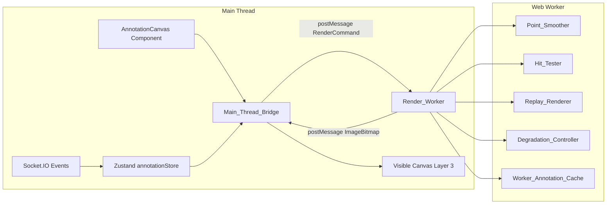
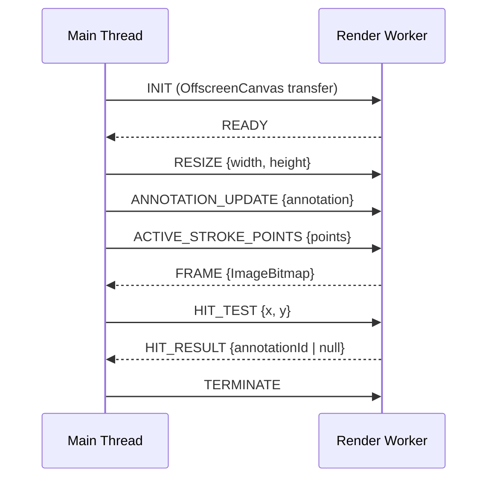
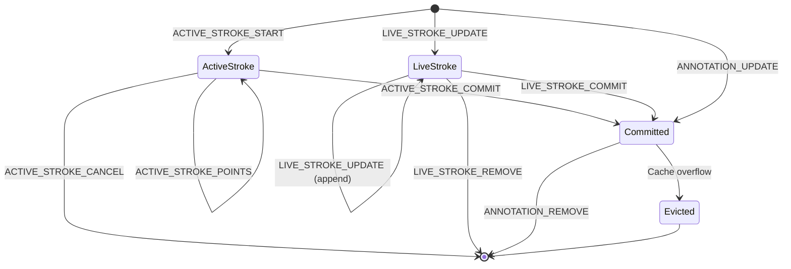

# Design Document: OffscreenCanvas Rendering

## Overview

This design moves annotation stroke rendering from the main thread (currently using Konva/react-konva in `AnnotationCanvas.tsx`) to a dedicated Web Worker using the OffscreenCanvas API. The worker owns all rendering for Layer 3 (Annotation) in the existing 5-layer rendering stack, eliminating UI jank during high-frequency annotation operations.

The architecture follows a unidirectional data flow:
1. Main thread captures pointer events and receives Socket.IO annotation updates
2. Main thread sends typed `RenderCommand` messages to the worker via `postMessage`
3. Worker renders annotations onto its OffscreenCanvas
4. Worker transfers rendered frames back as `ImageBitmap` Transferable objects
5. Main thread composites the `ImageBitmap` onto the visible annotation layer canvas

This approach preserves the existing Zustand annotation store as the source of truth on the main thread while offloading all Canvas2D draw calls to the worker thread.

### Key Design Decisions

1. **Worker owns the canvas context**: The canvas element is transferred once via `transferControlToOffscreen()`. The worker holds the sole 2D rendering context for the annotation layer.
2. **ImageBitmap frame transfer**: Rather than SharedArrayBuffer (limited browser support, COOP/COEP headers), we use `ImageBitmap` Transferable objects for zero-copy frame delivery.
3. **Existing worker pattern**: The render worker follows the same discriminated-union message protocol as `pptx-parser.worker.ts` for consistency.
4. **Graceful fallback**: If OffscreenCanvas is unsupported, the existing Konva-based rendering continues unchanged.
5. **Bounded caches**: Both the annotation cache and live stroke map enforce hard limits to prevent memory leaks in long sessions.

## Architecture



### Layer Stack (unchanged)

| Layer | Owner | Content |
|-------|-------|---------|
| 1 | PDF.js | Slide background / PDF page |
| 2 | Scene Graph Renderer | PPTX shapes (if native deck) |
| **3** | **Render_Worker (new)** | **Annotations, live strokes, lasers** |
| 4 | React DOM | Cursors, tooltips, UI overlays |
| 5 | React DOM | Toolbar, panels |

### Message Flow Sequence



## Components and Interfaces

### Main_Thread_Bridge

**Location**: `apps/web/src/features/annotation/lib/mainThreadBridge.ts`

Responsible for:
- Transferring the canvas to the worker on mount
- Subscribing to `annotationStore` changes and forwarding as `RenderCommand` messages
- Receiving `ImageBitmap` frames and compositing onto the visible canvas
- Forwarding hit-test requests/responses
- Feature-detecting OffscreenCanvas support and falling back to Konva

```typescript
interface MainThreadBridge {
  /** Initialize the bridge: transfer canvas, spawn worker */
  init(canvas: HTMLCanvasElement): Promise<void>;
  /** Tear down: terminate worker, release resources */
  destroy(): void;
  /** Send a render command to the worker */
  send(command: RenderCommand): void;
  /** Request a hit-test at normalized coordinates */
  hitTest(x: number, y: number): Promise<string | null>;
  /** Whether OffscreenCanvas is active (vs fallback) */
  readonly isOffscreen: boolean;
}
```

### Render_Worker

**Location**: `apps/web/src/features/annotation/workers/render.worker.ts`

The worker entry point. Handles the message loop, delegates to sub-components.

```typescript
// Worker internal state
interface WorkerState {
  canvas: OffscreenCanvas | null;
  ctx: OffscreenCanvasRenderingContext2D | null;
  viewportWidth: number;
  viewportHeight: number;
  cache: WorkerAnnotationCache;
  liveStrokes: Map<string, LiveStrokeState>;
  activeStroke: ActiveStrokeState | null;
  lasers: Map<string, LaserState>;
  degradationMode: 'normal' | 'degraded';
  dirty: boolean;
  replayState: ReplayState | null;
}
```

### RenderCommand Protocol

**Location**: `apps/web/src/features/annotation/types/renderCommand.types.ts`

All commands use a discriminated union on the `type` field, matching the pattern from `pptx-parser.worker.ts`.

```typescript
// ─── Main Thread → Worker Commands ───────────────────────────────────────────

type RenderCommand =
  | { type: 'INIT'; canvas: OffscreenCanvas }
  | { type: 'RESIZE'; width: number; height: number }
  | { type: 'ANNOTATION_UPDATE'; annotation: SerializedAnnotation }
  | { type: 'ANNOTATION_REMOVE'; annotationId: string }
  | { type: 'SLIDE_CHANGE'; slideId: string; annotations: SerializedAnnotation[] }
  | { type: 'LIVE_STROKE_UPDATE'; userId: string; points: Float64Array }
  | { type: 'LIVE_STROKE_COMMIT'; userId: string; annotation: SerializedAnnotation }
  | { type: 'LIVE_STROKE_REMOVE'; userId: string }
  | { type: 'ACTIVE_STROKE_START'; config: StrokeConfig }
  | { type: 'ACTIVE_STROKE_POINTS'; points: Float64Array }
  | { type: 'ACTIVE_STROKE_COMMIT'; annotationId: string }
  | { type: 'ACTIVE_STROKE_CANCEL' }
  | { type: 'HIT_TEST'; x: number; y: number; requestId: string }
  | { type: 'LASER_UPDATE'; userId: string; color: string; trail: Float64Array }
  | { type: 'LASER_REMOVE'; userId: string }
  | { type: 'SET_DEGRADATION_MODE'; mode: 'normal' | 'degraded' }
  | { type: 'REPLAY_START'; events: ReplayEvent[] }
  | { type: 'REPLAY_SEEK'; timestamp: number }
  | { type: 'REPLAY_STOP' }
  | { type: 'TERMINATE' };

// ─── Worker → Main Thread Responses ─────────────────────────────────────────

type WorkerResponse =
  | { type: 'READY' }
  | { type: 'FRAME'; bitmap: ImageBitmap }
  | { type: 'HIT_RESULT'; requestId: string; annotationId: string | null }
  | { type: 'ERROR'; message: string };

// ─── Supporting Types ────────────────────────────────────────────────────────

interface SerializedAnnotation {
  id: string;
  tool: 'freehand' | 'highlight' | 'arrow' | 'text';
  color: string;
  strokeWidth: number;
  opacity: number;
  /** Tool-specific data. Points stored as Float64Array for Transferable. */
  data: SerializedAnnotationData;
}

type SerializedAnnotationData =
  | { tool: 'freehand'; points: Float64Array }
  | { tool: 'highlight'; x: number; y: number; width: number; height: number }
  | { tool: 'arrow'; startX: number; startY: number; endX: number; endY: number }
  | { tool: 'text'; x: number; y: number; content: string; fontSize: number };

interface StrokeConfig {
  tool: 'freehand';
  color: string;
  strokeWidth: number;
  opacity: number;
}

interface ReplayEvent {
  timestamp: number;
  action: 'add' | 'remove';
  annotation?: SerializedAnnotation;
  annotationId?: string;
}
```

### Point_Smoother

**Location**: `apps/web/src/features/annotation/workers/pointSmoother.ts`

Pure function module that applies Catmull-Rom spline interpolation to raw point arrays.

```typescript
interface PointSmoother {
  /**
   * Smooth a flat point array [x0, y0, x1, y1, ...] using Catmull-Rom interpolation.
   * Returns a new flat array with interpolated points inserted between originals.
   * All original points are preserved in the output (interpolating, not approximating).
   */
  smooth(points: Float64Array, segmentsPerCurve?: number): Float64Array;

  /**
   * Decimate points for degraded mode: keep every Nth point.
   * Always preserves first and last point.
   */
  decimate(points: Float64Array, keepEvery: number): Float64Array;
}
```

**Algorithm**: Catmull-Rom spline with tension parameter τ = 0.5 (centripetal). For each segment between points P[i] and P[i+1], the spline uses control points P[i-1], P[i], P[i+1], P[i+2]. Boundary segments use reflected control points.

### Hit_Tester

**Location**: `apps/web/src/features/annotation/workers/hitTester.ts`

Performs geometric hit-testing in normalized coordinate space.

```typescript
interface HitTester {
  /**
   * Find the topmost annotation at the given normalized coordinate.
   * Returns annotation ID or null. Tests in reverse insertion order (highest z first).
   */
  test(
    x: number,
    y: number,
    cache: WorkerAnnotationCache,
    viewportWidth: number,
    viewportHeight: number
  ): string | null;
}
```

**Hit tolerance**: `strokeWidth / 2 + 6px` converted to normalized space using viewport dimensions.

**Geometry tests**:
- Freehand: point-to-polyline-segment distance
- Arrow: point-to-line-segment distance
- Highlight: point-in-rectangle
- Text: point-in-bounding-box (estimated from font metrics)

### Worker_Annotation_Cache

**Location**: `apps/web/src/features/annotation/workers/annotationCache.ts`

Bounded, ordered map of committed annotations for the current slide.

```typescript
class WorkerAnnotationCache {
  private entries: Map<string, SerializedAnnotation>; // preserves insertion order
  private maxCapacity: number;

  constructor(maxCapacity: number = 500);

  /** Add or update an annotation. Evicts oldest if at capacity. */
  set(annotation: SerializedAnnotation): void;

  /** Remove an annotation by ID. */
  delete(id: string): boolean;

  /** Get an annotation by ID. */
  get(id: string): SerializedAnnotation | undefined;

  /** Iterate in insertion order (z-order). */
  values(): IterableIterator<SerializedAnnotation>;

  /** Current size. */
  get size(): number;

  /** Clear all entries. */
  clear(): void;

  /** Update max capacity (for degradation mode transitions). */
  setMaxCapacity(capacity: number): void;
}
```

### Replay_Renderer

**Location**: `apps/web/src/features/annotation/workers/replayRenderer.ts`

Deterministic frame-by-frame replay engine.

```typescript
interface ReplayRenderer {
  /** Start replay with ordered events. */
  start(events: ReplayEvent[]): void;

  /** Advance to the next frame time. Returns annotations to render. */
  advanceTo(timestamp: number): SerializedAnnotation[];

  /** Seek to arbitrary timestamp by replaying from beginning. */
  seekTo(timestamp: number): SerializedAnnotation[];

  /** Stop replay and clear state. */
  stop(): void;

  readonly isActive: boolean;
}
```

### Degradation_Controller

**Location**: `apps/web/src/features/annotation/workers/degradationController.ts`

Controls quality reduction under load.

```typescript
interface DegradationController {
  mode: 'normal' | 'degraded';

  /** Whether point smoothing should be applied. */
  get smoothingEnabled(): boolean; // false when degraded

  /** Target frame interval in ms. */
  get frameInterval(): number; // 16.67ms normal, 33.33ms degraded

  /** Whether to decimate points. */
  get decimatePoints(): boolean; // true when degraded

  /** Max annotation cache size for current mode. */
  get maxCacheSize(): number; // 500 normal, 100 degraded
}
```

### Coordinate Utilities

**Location**: `apps/web/src/features/annotation/workers/coordinates.ts`

Pure functions for coordinate conversion and validation.

```typescript
/** Convert normalized [0,1] coordinate to pixel space. */
function toPixel(normalized: number, viewportSize: number): number;

/** Convert pixel coordinate to normalized [0,1] space. */
function toNormalized(pixel: number, viewportSize: number): number;

/** Clamp a value to [0, 1]. */
function clampNormalized(value: number): number;

/**
 * Validate and clamp all points in a Float64Array.
 * Points are [x0, y0, x1, y1, ...] in normalized space.
 */
function validatePoints(points: Float64Array): Float64Array;
```

## Data Models

### Annotation Lifecycle in Worker



### Worker Internal State Shape

```typescript
// Complete worker state (not exported, internal to worker)
interface InternalWorkerState {
  // Canvas
  canvas: OffscreenCanvas;
  ctx: OffscreenCanvasRenderingContext2D;
  viewportWidth: number;
  viewportHeight: number;

  // Annotation data
  cache: WorkerAnnotationCache;          // committed annotations
  liveStrokes: Map<string, LiveStrokeState>;  // remote in-progress
  activeStroke: ActiveStrokeState | null;      // local in-progress
  lasers: Map<string, LaserState>;            // laser pointers

  // Rendering state
  dirty: boolean;                        // needs re-render
  degradationMode: 'normal' | 'degraded';
  frameRequestId: number | null;         // rAF handle

  // Replay
  replayState: ReplayState | null;
}

interface LiveStrokeState {
  userId: string;
  color: string;
  strokeWidth: number;
  opacity: number;
  points: Float64Array;
}

interface ActiveStrokeState {
  config: StrokeConfig;
  points: Float64Array;
}

interface LaserState {
  userId: string;
  color: string;
  trail: Float64Array; // [x0, y0, x1, y1, ...] newest first
}

interface ReplayState {
  events: ReplayEvent[];
  currentIndex: number;
  annotations: Map<string, SerializedAnnotation>;
}
```

### Render Loop

The worker uses a `requestAnimationFrame`-equivalent loop (via `setTimeout` at target frame interval since `rAF` is not available in workers without OffscreenCanvas animation support in all browsers):

```
1. Process all queued commands (batch)
2. If dirty flag is set:
   a. Clear canvas
   b. Render cached annotations in insertion order
   c. Render live strokes (dashed, 0.8 opacity)
   d. Render active stroke (solid, full opacity)
   e. Render laser pointers (above all)
   f. Produce ImageBitmap via createImageBitmap(canvas)
   g. Transfer ImageBitmap to main thread
   h. Clear dirty flag
3. Schedule next frame (if active drawing) or wait for next command
```

### Transferable Strategy

| Data | Transfer Method |
|------|----------------|
| OffscreenCanvas | Transferable (once, on init) |
| Float64Array (points) | Transferable (main→worker) |
| ImageBitmap (frames) | Transferable (worker→main) |
| Command objects | Structured clone |

## Correctness Properties

*A property is a characteristic or behavior that should hold true across all valid executions of a system—essentially, a formal statement about what the system should do. Properties serve as the bridge between human-readable specifications and machine-verifiable correctness guarantees.*

### Property 1: Coordinate Normalization Round-Trip

*For any* normalized coordinate value in the range [0, 1] and any positive viewport dimension, converting to pixel space (multiply by viewport) and back to normalized space (divide by viewport) SHALL produce a value within 1e-10 of the original value.

**Validates: Requirements 12.1, 12.2, 12.3**

### Property 2: Point Smoother Preserves Endpoints and Passes Through Originals

*For any* input point array with 2 or more points, applying Catmull-Rom smoothing SHALL produce an output where: (a) the first output point equals the first input point, (b) the last output point equals the last input point, and (c) all original input points appear in the output array at their interpolated positions.

**Validates: Requirements 4.1, 4.3, 4.4**

### Property 3: Smoothing Disabled Produces Identity

*For any* input point array, when smoothing is disabled (either explicitly or via degraded mode), the smoother SHALL return the input points unchanged—the output array equals the input array.

**Validates: Requirements 4.2, 4.5, 10.2**

### Property 4: Hit-Test Geometric Correctness

*For any* annotation and any test point, the hit-tester SHALL return a hit if and only if the geometric distance from the point to the annotation shape is within the hit tolerance (strokeWidth/2 + 6px in pixel space, converted to normalized). Specifically: for freehand/arrow, point-to-segment distance ≤ tolerance; for highlight/text, point is within bounding rectangle.

**Validates: Requirements 5.2, 5.3, 5.4, 5.5**

### Property 5: Hit-Test Returns Highest Z-Order

*For any* set of overlapping annotations at a test point, the hit-tester SHALL return the annotation with the highest z-order (most recently inserted into the cache).

**Validates: Requirements 5.1, 5.6**

### Property 6: Hit-Test Resolution Independence

*For any* annotation set and test point in normalized coordinates, the hit-test result SHALL be identical regardless of the current viewport dimensions (the same normalized point hits the same annotation at any resolution).

**Validates: Requirements 5.7**

### Property 7: Bounded Annotation Cache with Eviction

*For any* sequence of annotation insertions, the Worker_Annotation_Cache SHALL never exceed its maximum capacity (500 in normal mode, 100 in degraded mode), and when at capacity, inserting a new annotation SHALL evict the oldest annotation (by insertion order).

**Validates: Requirements 7.2, 7.5**

### Property 8: Cache Preserves Insertion Order

*For any* sequence of annotation insertions, iterating the Worker_Annotation_Cache SHALL yield annotations in the exact order they were inserted (preserving z-order for rendering).

**Validates: Requirements 7.1, 7.4**

### Property 9: Bounded Live Stroke Map with Eviction

*For any* sequence of live stroke updates from distinct users, the live stroke map SHALL never exceed 50 entries, and when at capacity, adding a new user's stroke SHALL evict the oldest live stroke.

**Validates: Requirements 8.4, 8.5**

### Property 10: Render Command Serialization Round-Trip

*For any* valid RenderCommand object, serializing via the structured clone algorithm and then deserializing SHALL produce a deeply-equal object with identical property values, types, and array ordering.

**Validates: Requirements 14.1, 14.2, 14.3**

### Property 11: No Redundant Frames

*For any* sequence of render cycles where the annotation state has not changed since the last produced frame, the Render_Worker SHALL NOT produce a new Frame_Output (the dirty flag remains false when no commands modify visible state).

**Validates: Requirements 6.4**

### Property 12: Command Processing Order

*For any* sequence of RenderCommands sent to the worker, the worker SHALL process them in exactly the order received—no reordering or dropping.

**Validates: Requirements 2.7**

### Property 13: Replay Seek Equivalence

*For any* ordered sequence of timestamped replay events and any target timestamp T, seeking to T SHALL produce the same annotation state as sequentially replaying all events from the beginning up to timestamp T.

**Validates: Requirements 9.3, 9.4**

### Property 14: Point Decimation in Degraded Mode

*For any* freehand stroke with more than 20 points in degraded mode, the rendered point array SHALL contain only every second point from the original (plus the first and last points are always preserved).

**Validates: Requirements 10.4**

### Property 15: Coordinate Clamping

*For any* RenderCommand containing point arrays with coordinate values outside [0, 1], the Render_Worker SHALL clamp all values to the range [0, 1] inclusive before processing.

**Validates: Requirements 12.4**

### Property 16: Slide Change Resets Cache

*For any* slide change event with a new annotation set, after processing the SLIDE_CHANGE command, the Worker_Annotation_Cache SHALL contain exactly the annotations provided in the command and no annotations from the previous slide.

**Validates: Requirements 2.6, 7.3**

### Property 17: Stroke Commit Transfers to Cache

*For any* active stroke or live stroke that is committed, the committed annotation SHALL appear in the Worker_Annotation_Cache and the active/live stroke state for that user SHALL be cleared.

**Validates: Requirements 8.2, 13.3**

## Error Handling

### Worker Initialization Failures

| Scenario | Handling |
|----------|----------|
| OffscreenCanvas not supported | Fall back to Konva rendering, log warning |
| Worker fails to load (network/CSP) | Fall back to Konva rendering, log error |
| Worker posts ERROR instead of READY | Fall back to Konva rendering, log error with message |
| Canvas transfer fails | Fall back to Konva rendering, log error |

### Runtime Errors

| Scenario | Handling |
|----------|----------|
| Worker throws during render | Catch in worker, post ERROR message, skip frame, mark dirty for retry |
| ImageBitmap creation fails | Log warning, skip frame, retry next cycle |
| Invalid RenderCommand received | Log warning with command type, ignore command |
| Out-of-range coordinates | Clamp to [0, 1] silently (Property 15) |
| Cache overflow | Evict oldest (Property 7), log at debug level |
| Worker becomes unresponsive (>5s no FRAME during active drawing) | Main thread terminates worker, falls back to Konva |

### Graceful Degradation Chain

```
Normal Mode (60fps, smoothing, full cache)
    ↓ SET_DEGRADATION_MODE degraded
Degraded Mode (30fps, no smoothing, decimation, 100 cache)
    ↓ Worker unresponsive
Fallback Mode (Konva on main thread)
```

### Resource Cleanup

On `TERMINATE`:
1. Cancel any pending frame timeout
2. Clear the annotation cache
3. Clear live strokes and laser maps
4. Release the 2D rendering context (set to null)
5. Close the worker via `self.close()`

On main thread unmount:
1. Send `TERMINATE` to worker
2. Call `worker.terminate()` after 1s timeout (force kill)
3. Close any pending ImageBitmaps
4. Remove the compositing canvas reference

## Testing Strategy

### Property-Based Tests (fast-check)

The project already uses `fast-check` (v4.8.0) in devDependencies. Each correctness property above maps to a property-based test with minimum 100 iterations.

**Test file**: `apps/web/src/features/annotation/workers/__tests__/render.worker.property.test.ts`

| Property | Module Under Test | Generator Strategy |
|----------|-------------------|-------------------|
| 1: Coordinate round-trip | `coordinates.ts` | Random floats in [0,1], random positive viewport dims |
| 2: Smoother preserves endpoints | `pointSmoother.ts` | Random Float64Arrays (length 4+, pairs of [0,1] values) |
| 3: Smoothing disabled = identity | `pointSmoother.ts` | Random Float64Arrays |
| 4: Hit-test geometry | `hitTester.ts` | Random annotations + random test points |
| 5: Hit-test z-order | `hitTester.ts` | Random overlapping annotations |
| 6: Hit-test resolution independence | `hitTester.ts` | Random annotations + points + viewport dims |
| 7: Bounded cache eviction | `annotationCache.ts` | Random annotation sequences (length > 500) |
| 8: Cache insertion order | `annotationCache.ts` | Random annotation sequences |
| 9: Bounded live strokes | Worker state logic | Random user IDs (> 50 distinct) |
| 10: Serialization round-trip | `renderCommand.types.ts` | Random valid RenderCommand objects |
| 11: No redundant frames | Render loop logic | Random command sequences with repeated states |
| 12: Command ordering | Worker message handler | Random command sequences |
| 13: Replay seek equivalence | `replayRenderer.ts` | Random timestamped events + seek targets |
| 14: Point decimation | `pointSmoother.ts` | Random strokes with > 20 points |
| 15: Coordinate clamping | `coordinates.ts` | Random floats including out-of-range |
| 16: Slide change resets | `annotationCache.ts` | Random annotation sets for two slides |
| 17: Commit transfers to cache | Worker state logic | Random strokes |

**Tag format**: Each test is tagged with a comment:
```typescript
// Feature: offscreen-canvas-rendering, Property 1: Coordinate normalization round-trip
```

### Unit Tests (example-based)

**Test file**: `apps/web/src/features/annotation/workers/__tests__/render.worker.test.ts`

- Worker initialization handshake (INIT → READY)
- OffscreenCanvas fallback detection
- TERMINATE cleanup sequence
- Each stroke type renders correct Canvas2D calls (mock ctx)
- Live stroke dashed style (setLineDash, 0.8 opacity)
- Active stroke solid style (no dash, full opacity)
- Laser pointer head dot and trail rendering
- Degradation mode transitions
- Replay start/seek/stop lifecycle
- Hit-test request/response flow
- Float64Array Transferable inclusion

### Integration Tests

- Full round-trip: mount component → draw stroke → verify ImageBitmap received
- Slide change: verify cache cleared and new annotations rendered
- Fallback mode: mock no OffscreenCanvas support → verify Konva renders

### Test Configuration

```typescript
// vitest.config.ts additions
{
  test: {
    // Workers need jsdom or happy-dom for OffscreenCanvas mocks
    environment: 'jsdom',
    // Property tests need longer timeout
    testTimeout: 30_000,
  }
}
```

All property tests use `fc.assert(fc.property(...), { numRuns: 100 })` minimum. The coordinate round-trip and cache tests use `numRuns: 1000` for higher confidence given the simplicity of each iteration.
