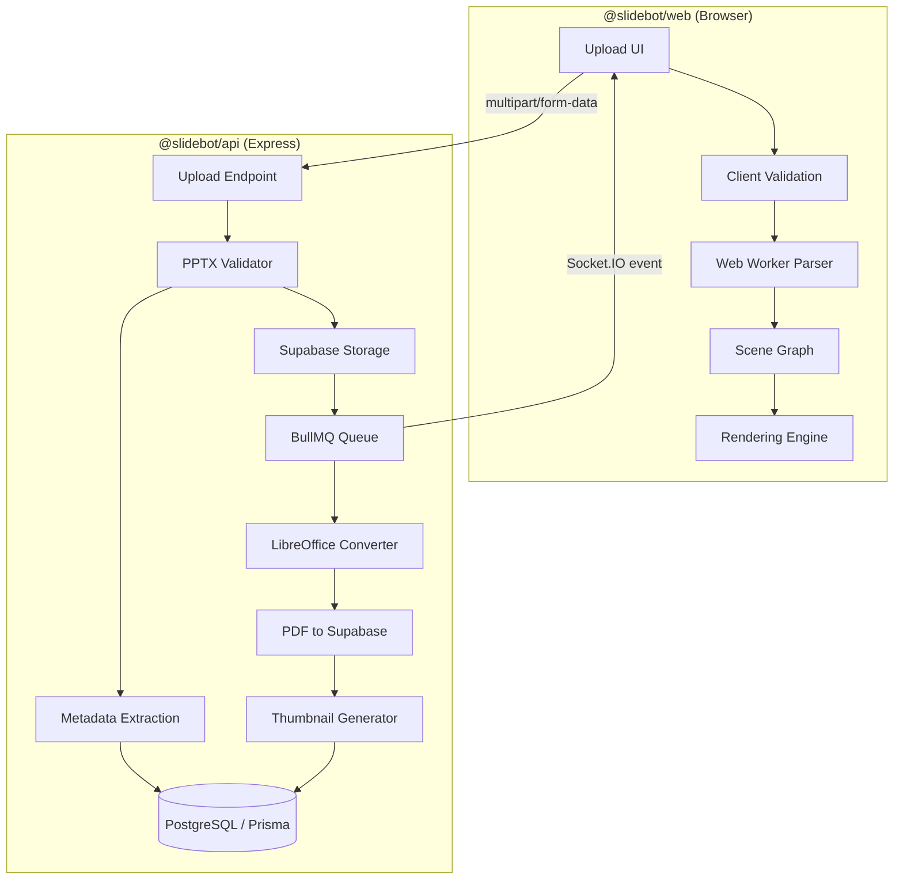
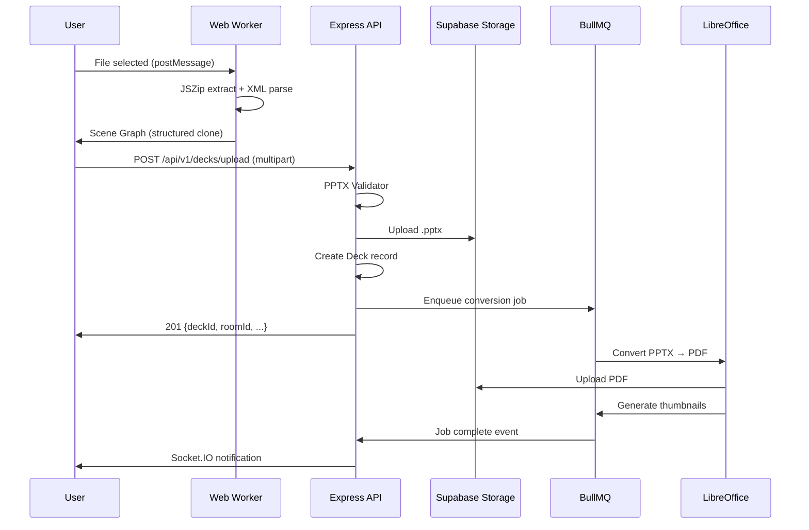

# Design Document: PPTX Ingestion Pipeline

## Overview

The PPTX Ingestion Pipeline extends SlideBot's existing PDF-only upload flow to accept Microsoft PowerPoint (.pptx) files. The system operates as a dual-path pipeline:

1. **Client-side fast path**: A Web Worker parses the PPTX archive in-browser using JSZip and fast-xml-parser, producing a Unified Scene Graph for immediate preview rendering.
2. **Server-side high-fidelity path**: A BullMQ job queues LibreOffice headless conversion to PDF, producing pixel-perfect static renders and slide thumbnails.

Both paths converge on the existing Deck/Slide/Room database models and Supabase Storage infrastructure. The client-side path provides instant interactivity while the server-side path delivers visual accuracy for complex slides.

### Key Design Decisions

| Decision | Choice | Rationale |
|----------|--------|-----------|
| Client-side parsing library | JSZip + fast-xml-parser | Already available in the ecosystem, lightweight, Web Worker compatible |
| Coordinate system | 1920×1080 virtual viewport | Matches existing rendering engine expectations |
| Server conversion | LibreOffice headless | Free, supports full OOXML fidelity, sandboxable |
| Job queue | BullMQ (existing) | Already configured with Redis in the API server |
| Property-based testing | fast-check (existing) | Already a devDependency in @slidebot/web |

## Architecture



### Data Flow



## Components and Interfaces

### 1. PPTX Validator (`apps/api/src/modules/decks/pptx-validator.ts`)

Validates uploaded files for structural integrity and security.

```typescript
interface PptxValidationResult {
  valid: boolean;
  error?: string;
  slideCount?: number;
  contentTypesXml?: string;
}

interface PptxValidatorOptions {
  maxFileSize: number;           // 100MB
  maxDecompressedSize: number;   // 500MB
  maxSingleEntrySize: number;    // 200MB
  maxEntryCount: number;         // 10,000
  timeoutMs: number;             // 30,000
}

function validatePptx(buffer: Buffer, options: PptxValidatorOptions): Promise<PptxValidationResult>;
```

### 2. Web Worker Parser (`apps/web/src/features/decks/workers/pptx-parser.worker.ts`)

Client-side PPTX parsing in a dedicated Web Worker.

```typescript
// Messages TO the worker
type PptxParserRequest =
  | { type: 'PARSE'; file: ArrayBuffer }
  | { type: 'CANCEL' };

// Messages FROM the worker
type PptxParserResponse =
  | { type: 'PROGRESS'; stage: ParsingStage; percent: number }
  | { type: 'COMPLETE'; document: PresentationDocument }
  | { type: 'ERROR'; stage: ParsingStage; message: string };

type ParsingStage = 'zip-extraction' | 'xml-parsing' | 'scene-graph-construction';
```

### 3. OOXML Resolver (`apps/web/src/features/decks/lib/ooxml-resolver.ts`)

Resolves theme, master, and layout inheritance hierarchies.

```typescript
interface ResolvedTheme {
  colorScheme: Record<string, string>;  // schemeClr name → #RRGGBB
  majorFont: string;
  minorFont: string;
}

interface ResolvedSlideContext {
  theme: ResolvedTheme;
  masterDefaults: ShapeDefaults;
  layoutDefaults: ShapeDefaults;
}

function resolveSlideContext(
  themeXml: string,
  masterXml: string,
  layoutXml: string
): ResolvedSlideContext;
```

### 4. Shape Extractor (`apps/web/src/features/decks/lib/shape-extractor.ts`)

Extracts visual elements from parsed slide XML.

```typescript
interface ExtractedShape {
  type: 'text' | 'geometry' | 'image' | 'table' | 'background';
  position: { x: number; y: number; width: number; height: number }; // EMU
  properties: TextProperties | GeometryProperties | ImageProperties | TableProperties | BackgroundProperties;
  zIndex: number;
}

function extractShapes(
  slideXml: ParsedXml,
  relationships: Record<string, string>,
  context: ResolvedSlideContext
): ExtractedShape[];
```

### 5. Scene Graph Normalizer (`packages/shared-types/src/scene-graph.ts`)

Transforms extracted shapes into the Unified Scene Graph.

```typescript
interface PresentationDocument {
  slides: Slide[];
  metadata: DocumentMetadata;
}

interface Slide {
  elements: SlideElement[];
  background?: BackgroundElement;
}

interface SlideElement {
  type: 'text' | 'shape' | 'image' | 'table' | 'placeholder';
  x: number;      // Virtual viewport (0–1920), 2 decimal places
  y: number;      // Virtual viewport (0–1080), 2 decimal places
  width: number;  // Virtual viewport units, 2 decimal places
  height: number; // Virtual viewport units, 2 decimal places
  zIndex: number;
  properties: ElementProperties;
}

interface DocumentMetadata {
  title: string;
  author: string;
  slideCount: number;
}

function normalize(
  shapes: ExtractedShape[],
  sourceWidth: number,
  sourceHeight: number
): SlideElement[];

function serialize(doc: PresentationDocument, pretty?: boolean): string;
function deserialize(json: string): PresentationDocument;
```

### 6. Conversion Queue (`apps/api/src/modules/decks/conversion-queue.ts`)

BullMQ-based job queue for server-side conversion.

```typescript
interface ConversionJobData {
  deckId: string;
  storagePath: string;
  ownerId: string;
}

interface ConversionJobResult {
  pdfStoragePath: string;
  thumbnailPaths: string[];
}

// Queue configuration
const CONVERSION_QUEUE_NAME = 'pptx-conversion';
const JOB_TIMEOUT_MS = 60_000;
const MAX_RETRIES = 3;
const INITIAL_BACKOFF_MS = 5_000;
```

### 7. Thumbnail Generator (`apps/api/src/modules/decks/thumbnail-generator.ts`)

Produces slide thumbnails from the converted PDF.

```typescript
interface ThumbnailOptions {
  width: 320;
  height: 180;
  format: 'png';
}

function generateThumbnails(
  pdfBuffer: Buffer,
  slideCount: number,
  options: ThumbnailOptions
): Promise<Buffer[]>;
```

## Data Models

### Prisma Schema Changes

The existing `Deck` model needs additional fields to support PPTX-specific metadata and conversion status:

```prisma
model Deck {
  id              String   @id @default(cuid())
  ownerId         String
  workspaceId     String?
  name            String
  storagePath     String   @default("")
  slides          Int      @default(1)
  
  // New fields for PPTX ingestion
  sourceType      String   @default("pdf")        // "pdf" | "pptx"
  author          String?                          // Extracted from docProps/core.xml
  pdfStoragePath  String?  @map("pdf_storage_path") // Path to converted PDF
  conversionStatus String  @default("none")       // "none" | "pending" | "processing" | "completed" | "failed"
  sceneGraphJson  String?  @map("scene_graph_json") // Serialized PresentationDocument
  thumbnailPrefix String?  @map("thumbnail_prefix") // Storage prefix for thumbnails

  createdAt       DateTime @default(now())
  updatedAt       DateTime @updatedAt

  // Existing relations unchanged
  owner         User                  @relation(fields: [ownerId], references: [id])
  workspace     Workspace?            @relation(fields: [workspaceId], references: [id], onDelete: Cascade)
  rooms         Room[]
  slideEntities Slide[]
  collaborators DeckCollaborator[]
  sessions      PresentationSession[]

  @@index([ownerId])
  @@index([workspaceId])
  @@map("decks")
}
```

### Scene Graph Type Hierarchy

```typescript
// PresentationDocument (root)
interface PresentationDocument {
  slides: Slide[];
  metadata: DocumentMetadata;
}

// DocumentMetadata
interface DocumentMetadata {
  title: string;
  author: string;
  slideCount: number;
  sourceWidth: number;   // Original EMU width
  sourceHeight: number;  // Original EMU height
}

// Slide
interface Slide {
  elements: SlideElement[];
  background?: BackgroundElement;
}

// SlideElement (discriminated union via `type`)
type SlideElement = TextElement | ShapeElement | ImageElement | TableElement | PlaceholderElement;

interface BaseElement {
  x: number;
  y: number;
  width: number;
  height: number;
  zIndex: number;
}

interface TextElement extends BaseElement {
  type: 'text';
  properties: {
    content: string;
    fontFamily: string;
    fontSize: number;
    fontWeight: 'normal' | 'bold';
    fontStyle: 'normal' | 'italic';
    color: string;          // #RRGGBB
    alignment: 'left' | 'center' | 'right' | 'justify';
    paragraphs: Paragraph[];
  };
}

interface ShapeElement extends BaseElement {
  type: 'shape';
  properties: {
    shapeType: string;      // e.g., 'rect', 'ellipse', 'roundRect'
    fillColor?: string;     // #RRGGBB
    outlineColor?: string;  // #RRGGBB
    outlineWidth?: number;
  };
}

interface ImageElement extends BaseElement {
  type: 'image';
  properties: {
    dataUri: string;        // base64 data URI for client-side
    contentType: string;    // e.g., 'image/png'
    altText?: string;
  };
}

interface TableElement extends BaseElement {
  type: 'table';
  properties: {
    rows: number;
    columns: number;
    cells: TableCell[][];
    merges: CellMerge[];
  };
}

interface PlaceholderElement extends BaseElement {
  type: 'placeholder';
  properties: {
    unsupportedType: string;
  };
}

interface BackgroundElement {
  type: 'solid' | 'gradient' | 'image';
  color?: string;
  gradientStops?: { offset: number; color: string }[];
  imageDataUri?: string;
}

interface Paragraph {
  runs: TextRun[];
  alignment: 'left' | 'center' | 'right' | 'justify';
}

interface TextRun {
  text: string;
  fontFamily?: string;
  fontSize?: number;
  bold?: boolean;
  italic?: boolean;
  color?: string;
}

interface TableCell {
  content: string;
  rowSpan: number;
  colSpan: number;
}

interface CellMerge {
  startRow: number;
  startCol: number;
  rowSpan: number;
  colSpan: number;
}
```

### EMU to Virtual Viewport Conversion

```
EMU (English Metric Units): 1 inch = 914400 EMU
Standard PPTX slide: 9144000 × 6858000 EMU (10" × 7.5")
Virtual Viewport: 1920 × 1080 pixels

Conversion formula:
  scaleX = 1920 / sourceSlideWidth
  scaleY = 1080 / sourceSlideHeight
  scale = min(scaleX, scaleY)  // Preserve aspect ratio
  
  offsetX = (1920 - sourceSlideWidth * scale) / 2  // Center horizontally
  offsetY = (1080 - sourceSlideHeight * scale) / 2  // Center vertically
  
  viewportX = round(emuX * scale + offsetX, 2)
  viewportY = round(emuY * scale + offsetY, 2)
  viewportW = round(emuWidth * scale, 2)
  viewportH = round(emuHeight * scale, 2)
```


## Correctness Properties

*A property is a characteristic or behavior that should hold true across all valid executions of a system — essentially, a formal statement about what the system should do. Properties serve as the bridge between human-readable specifications and machine-verifiable correctness guarantees.*

### Property 1: Structural Validation Correctness

*For any* ZIP archive, the PPTX Validator SHALL accept it if and only if it contains `[Content_Types].xml`, `_rels/.rels`, `ppt/presentation.xml`, and at least one `ppt/slides/slide*.xml` entry. Archives missing any of these required entries SHALL be rejected.

**Validates: Requirements 2.1, 2.5**

### Property 2: Non-ZIP Data Rejection

*For any* byte sequence that is not a valid ZIP archive, the PPTX Validator SHALL reject it with an error indicating the file is not a valid PPTX archive.

**Validates: Requirements 2.2**

### Property 3: Path Traversal Detection

*For any* ZIP archive containing at least one entry whose path includes a traversal sequence (e.g., `../`, `..\`, or any path component that would escape the archive root), the PPTX Validator SHALL reject the archive.

**Validates: Requirements 2.3**

### Property 4: Decompression Bomb Detection

*For any* ZIP archive where the sum of all entries' declared uncompressed sizes exceeds 500MB, or any single entry declares an uncompressed size exceeding 200MB, the PPTX Validator SHALL reject the archive.

**Validates: Requirements 2.4**

### Property 5: Theme Inheritance Resolution

*For any* slide with a theme, slide master, and slide layout, when a property is defined at multiple levels, the most specific level SHALL win (Slide > Layout > Master > Theme). When a property is defined only at a higher level, it SHALL cascade down as the default value.

**Validates: Requirements 4.1, 4.2**

### Property 6: Theme Reference Resolution

*For any* theme color reference (schemeClr) or font reference in a slide element, the OOXML Resolver SHALL resolve it to a concrete value (RGB hex string for colors, font family name for fonts) that matches the corresponding entry in the theme definition.

**Validates: Requirements 4.3, 4.4**

### Property 7: Shape Extraction Completeness

*For any* slide XML containing shapes of supported types (text, geometry, table), the Shape Extractor SHALL produce an extracted shape for each input shape, and each extracted shape SHALL contain all specified properties for its type (text: content, font properties, alignment, color; geometry: shape type, fill, outline, position; table: row count, column count, cell content, merges).

**Validates: Requirements 5.1, 5.2, 5.4**

### Property 8: Relationship Resolution

*For any* shape that references a relationship ID (rId), and a corresponding `_rels` file that maps that rId to a target path, the Shape Extractor SHALL resolve the reference to the correct target path.

**Validates: Requirements 5.6**

### Property 9: EMU to Virtual Viewport Coordinate Conversion

*For any* EMU coordinate (x, y, width, height) and source slide dimensions, the Scene Graph Normalizer SHALL produce Virtual Viewport coordinates by scaling proportionally to fit within 1920×1080 while preserving the source aspect ratio and centering the content. The resulting coordinates SHALL satisfy: `0 ≤ x ≤ 1920`, `0 ≤ y ≤ 1080`, `width > 0`, `height > 0`, and the aspect ratio of the converted element SHALL equal the aspect ratio of the source element.

**Validates: Requirements 6.2**

### Property 10: Z-Order Preservation

*For any* ordered sequence of shapes from source slide XML, the Scene Graph Normalizer SHALL produce a SlideElements array where the relative ordering of elements matches the source ordering (first element in source = lowest z-index in output).

**Validates: Requirements 6.3**

### Property 11: Serialization Round-Trip and Idempotence

*For any* valid PresentationDocument, serializing to JSON then deserializing SHALL produce a deeply-equal PresentationDocument. Furthermore, serializing the deserialized result SHALL produce byte-identical JSON output (serialize(deserialize(serialize(doc))) === serialize(doc)).

**Validates: Requirements 6.4, 10.1, 10.2, 10.4**

### Property 12: Coordinate Precision

*For any* EMU input value, all Virtual Viewport coordinate values in the normalized output SHALL be floating-point numbers with at most 2 decimal places.

**Validates: Requirements 6.6**

### Property 13: Unsupported Type Placeholder

*For any* slide element whose type is not one of the supported types (text, shape, image, table, background), the Scene Graph Normalizer SHALL emit a placeholder element containing the unsupported type name as a string and the element's bounding box in Virtual Viewport coordinates.

**Validates: Requirements 6.5**

### Property 14: Metadata Extraction from Core Properties

*For any* valid `docProps/core.xml` containing title, author, and subject fields, the parser SHALL extract values that exactly match the text content of those XML elements.

**Validates: Requirements 9.1**

### Property 15: Slide Count Accuracy

*For any* PPTX archive containing N files matching the pattern `ppt/slides/slide*.xml`, the parser SHALL report a slide count of exactly N.

**Validates: Requirements 3.3, 9.4**

### Property 16: Progress Message Validity

*For any* parsing operation, all emitted progress messages SHALL have a valid stage identifier (one of: 'zip-extraction', 'xml-parsing', 'scene-graph-construction') and a percentage value that is an integer in the range [0, 100].

**Validates: Requirements 3.4**

## Error Handling

### Upload Errors

| Error Condition | HTTP Status | Error Message | Recovery |
|----------------|-------------|---------------|----------|
| File exceeds 100MB | 400 | "File is too large. Maximum size is 100MB." | User re-uploads smaller file |
| Invalid MIME type and extension | 400 | "Please upload a valid PDF or PPTX file." | User selects correct file |
| Structural validation fails | 400 | "The file is not a valid PPTX document." | User re-exports from PowerPoint |
| Path traversal detected | 400 | "The file contains invalid path entries." | User re-exports from PowerPoint |
| Decompression bomb detected | 400 | "The file exceeds decompression size limits." | User simplifies presentation |
| Entry count exceeded | 400 | "The archive contains too many entries." | User simplifies presentation |
| Validation timeout (30s) | 400 | "File validation timed out. Please try a smaller file." | User reduces file size |
| Supabase upload failure | 500 | "Storage upload failed. Please try again." | Retry upload |
| Metadata extraction failure | — | Graceful fallback to filename/username | No user action needed |

### Web Worker Errors

| Error Condition | Message Type | Behavior |
|----------------|-------------|----------|
| ZIP extraction failure | `ERROR` with stage 'zip-extraction' | Discard partial results, show error toast |
| XML parsing failure | `ERROR` with stage 'xml-parsing' | Discard partial results, show error toast |
| Scene graph construction failure | `ERROR` with stage 'scene-graph-construction' | Discard partial results, show error toast |
| Worker timeout (30s) | `ERROR` with timeout indication | Terminate worker, show timeout message |
| Worker crash | `error` event on Worker | Recreate worker, show generic error |

### Conversion Queue Errors

| Error Condition | Behavior | Final State |
|----------------|----------|-------------|
| LibreOffice crash | Retry with exponential backoff (5s, 10s, 20s) | Up to 3 retries |
| Conversion timeout (60s) | Treat as failure, trigger retry | Up to 3 retries |
| All retries exhausted | Mark Deck as `conversionStatus: 'failed'` | Client uses Scene Graph |
| PDF upload to Supabase fails | Retry as part of job retry | Up to 3 retries |
| Thumbnail generation fails (single slide) | Continue with remaining slides, log failure | Partial thumbnails available |

### Graceful Degradation Strategy

The system operates in a progressive enhancement model:

1. **Immediate**: Client-side Scene Graph provides instant preview (lower fidelity)
2. **Eventually**: Server-side PDF conversion provides high-fidelity rendering
3. **Fallback**: If conversion fails permanently, the Scene Graph remains the primary rendering source

This ensures users are never blocked from presenting, even if server-side processing fails.

## Testing Strategy

### Property-Based Tests (fast-check)

The project already uses `fast-check` (v4.8.0) as a devDependency in `@slidebot/web`. Property-based tests will be configured with a minimum of 100 iterations per property.

**Tag format**: `Feature: pptx-ingestion, Property {number}: {property_text}`

Property tests target the pure logic components:
- Scene Graph Normalizer (coordinate conversion, serialization, z-order)
- PPTX Validator (structural checks, security checks)
- OOXML Resolver (theme inheritance, reference resolution)
- Shape Extractor (extraction completeness, relationship resolution)
- Metadata Parser (core.xml extraction, slide counting)

### Unit Tests (vitest)

Example-based unit tests for:
- Upload endpoint behavior (MIME type acceptance, extension-based acceptance)
- Fallback behavior (missing metadata → filename/username defaults)
- Error message formatting
- Retry configuration verification
- Progress message emission

### Integration Tests

- End-to-end upload flow (file → storage → Deck record)
- BullMQ job lifecycle (enqueue → process → complete/fail)
- LibreOffice conversion (PPTX → PDF output)
- Thumbnail generation (PDF → PNG at correct dimensions)
- Supabase Storage operations (upload, signed URL generation)

### Test Organization

```
apps/web/src/features/decks/__tests__/
  pptx-validator.test.ts          # Properties 1-4
  ooxml-resolver.test.ts          # Properties 5-6
  shape-extractor.test.ts         # Properties 7-8
  scene-graph-normalizer.test.ts  # Properties 9-13
  metadata-parser.test.ts         # Properties 14-15
  pptx-parser-worker.test.ts      # Property 16

apps/api/src/modules/decks/__tests__/
  pptx-upload.test.ts             # Upload endpoint unit tests
  conversion-queue.test.ts        # Queue behavior tests
  thumbnail-generator.test.ts     # Thumbnail integration tests
```
