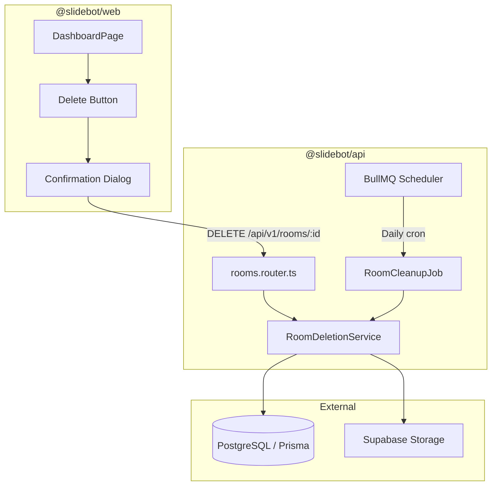
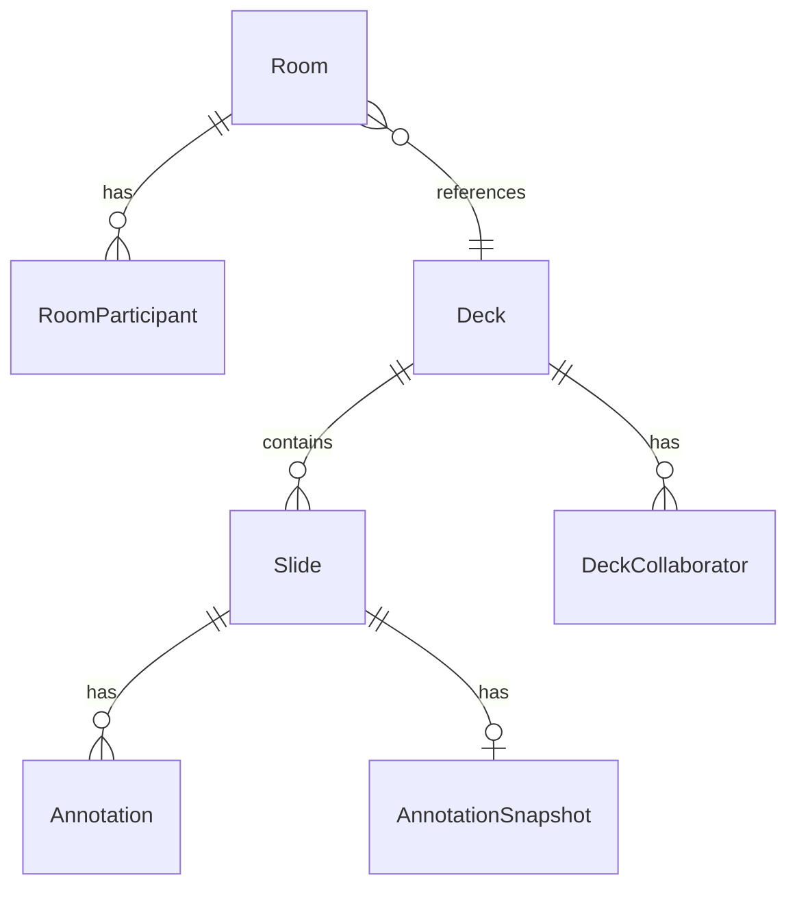

# Design Document: Room Cleanup

## Overview

Room Cleanup adds manual and automatic deletion of rooms and their associated data (decks, slides, annotations, storage files) to SlideBot. The feature consists of three main components:

1. **DELETE API Endpoint** (`DELETE /api/v1/rooms/:id`) — allows room owners to delete rooms via the dashboard
2. **Cleanup Service** — a scheduled job that automatically purges rooms older than 10 days
3. **Dashboard UI** — a delete button on room cards with confirmation dialog and optimistic removal

The design follows the existing modular architecture: Express router + service layer for the API, BullMQ for scheduled jobs, and React + Zustand for the frontend.

## Architecture



### Key Design Decisions

1. **Shared deletion service**: Both manual and automatic deletion use the same `RoomDeletionService` to ensure consistent cascade logic and avoid duplication.
2. **Soft-fail on storage errors**: If Supabase Storage file deletion fails, the database records are still removed and the error is logged. This prevents orphaned DB records from blocking cleanup.
3. **Batch processing for cleanup job**: The scheduled job processes rooms in batches of 100 to keep database transactions under 30 seconds.
4. **Active room protection**: Rooms with `status: "active"` are never deleted by the cleanup job. Manual deletion of active rooms first ends the session.
5. **Shared deck protection**: A deck is only deleted when the last room referencing it is removed, preventing data loss for shared decks.

## Components and Interfaces

### 1. RoomDeletionService

Location: `apps/api/src/modules/rooms/room-deletion.service.ts`

```typescript
interface DeletionResult {
  roomId: string;
  deckDeleted: boolean;
  storageDeleted: boolean;
  error?: string;
}

interface RoomDeletionService {
  /**
   * Delete a single room and cascade to associated data.
   * If the room is active, ends the session first.
   * Only deletes the deck/storage if no other rooms reference the same deck.
   */
  deleteRoom(roomId: string, requesterId: string): Promise<DeletionResult>;

  /**
   * Find and delete all expired rooms (createdAt > 10 days ago).
   * Skips active rooms. Processes in batches of 100.
   * Returns results for each room processed.
   */
  deleteExpiredRooms(): Promise<DeletionResult[]>;
}
```

### 2. DELETE Endpoint

Location: `apps/api/src/modules/rooms/rooms.router.ts`

```
DELETE /api/v1/rooms/:id
Authorization: Bearer <token>

Responses:
  204 No Content — room and associated data deleted
  401 Unauthorized — missing/invalid token
  403 Forbidden — requester is not the room owner
  404 Not Found — room ID invalid or not found
```

### 3. RoomCleanupJob

Location: `apps/api/src/modules/rooms/room-cleanup.job.ts`

A BullMQ repeatable job that runs once per day. It queries for expired rooms, delegates to `RoomDeletionService.deleteExpiredRooms()`, and logs results.

### 4. Frontend Components

| Component | Location | Responsibility |
|-----------|----------|----------------|
| `DeleteRoomButton` | `apps/web/src/features/decks/components/DeleteRoomButton.tsx` | Trash icon button with tooltip, spinner state |
| `DeleteRoomDialog` | `apps/web/src/features/decks/components/DeleteRoomDialog.tsx` | Confirmation dialog with deck name and warning |
| `useDeleteRoom` | `apps/web/src/features/decks/hooks/useDeleteRoom.ts` | Mutation hook calling DELETE endpoint, optimistic UI removal |

### 5. API Client

Location: `apps/web/src/features/decks/api/roomsApi.ts`

```typescript
export async function deleteRoom(roomId: string): Promise<void>;
```

## Data Models

### Existing Models (no schema changes required)

The cascade deletion leverages existing Prisma relations. The deletion order respects foreign key constraints:



### Deletion Order

```
1. Annotations (where slideId in deck's slides)
2. AnnotationSnapshots (where slideId in deck's slides)
3. Slides (where deckId = deck.id)
4. Supabase Storage file (deck.storagePath)
5. Deck record (only if no other rooms reference it)
6. RoomParticipants (where roomId = room.id)
7. Room record
```

### Shared Deck Check Query

```sql
SELECT COUNT(*) FROM rooms WHERE "deckId" = $1 AND id != $2
```

If count > 0, skip steps 1–5 (deck is still referenced by other rooms).

### Expired Rooms Query

```sql
SELECT id FROM rooms
WHERE "createdAt" < NOW() - INTERVAL '10 days'
  AND status != 'active'
ORDER BY "createdAt" ASC
LIMIT 100
```

## Correctness Properties

*A property is a characteristic or behavior that should hold true across all valid executions of a system — essentially, a formal statement about what the system should do. Properties serve as the bridge between human-readable specifications and machine-verifiable correctness guarantees.*

### Property 1: Complete cascade deletion

*For any* room with any number of participants, slides, annotations, and annotation snapshots, after successful deletion, the room record, all its RoomParticipant records, and (when the deck is not shared) all Slide, Annotation, and AnnotationSnapshot records associated with the deck SHALL no longer exist in the database.

**Validates: Requirements 1.2, 2.3, 4.2, 4.3**

### Property 2: Shared deck protection

*For any* deck referenced by N rooms (where N > 1), deleting one of those rooms SHALL NOT delete the deck record or its storage file. The deck and storage file SHALL only be deleted when the last room referencing that deck is removed.

**Validates: Requirements 1.3, 2.2, 4.1, 4.4**

### Property 3: Authorization enforcement

*For any* authenticated user who is not the room's presenter (owner), a DELETE request to that room SHALL return a 403 Forbidden response and the room SHALL remain unchanged in the database.

**Validates: Requirements 1.6, 5.5**

### Property 4: Expiration selection

*For any* set of rooms with varying `createdAt` timestamps and statuses, the cleanup service SHALL select for deletion only those rooms where `createdAt` is more than 240 hours before the current UTC time AND whose status is not "active". Active rooms SHALL never be selected regardless of age.

**Validates: Requirements 2.1, 2.7**

### Property 5: Error resilience in batch processing

*For any* batch of N expired rooms where K rooms (0 ≤ K < N) fail during deletion, the cleanup service SHALL successfully process all remaining (N - K) rooms and log errors for each of the K failed rooms including their room IDs.

**Validates: Requirements 2.5**

### Property 6: Batch size constraint

*For any* number of expired rooms in the database, the cleanup service SHALL process them in batches of no more than 100 rooms per batch.

**Validates: Requirements 2.6**

### Property 7: Deletion order invariant

*For any* room deletion (where the deck is not shared), the cascade operations SHALL execute in the order: Annotations → AnnotationSnapshots → Slides → Storage file → Deck record → RoomParticipants → Room record.

**Validates: Requirements 4.6**

### Property 8: Transaction atomicity

*For any* room deletion where a database operation fails (excluding storage file deletion), the entire transaction SHALL roll back and no records SHALL be deleted. The room and all associated data SHALL remain intact.

**Validates: Requirements 5.6**

### Property 9: Invalid ID rejection

*For any* string that is not a valid UUID or does not correspond to an existing room record, a DELETE request SHALL return a 404 Not Found response.

**Validates: Requirements 5.3**

## Error Handling

### API Endpoint Errors

| Scenario | HTTP Status | Response Body | Action |
|----------|-------------|---------------|--------|
| Missing/invalid auth token | 401 | `{ error: { code: "UNAUTHORIZED", message: "..." } }` | Reject request |
| Non-owner attempts deletion | 403 | `{ error: { code: "FORBIDDEN", message: "..." } }` | Reject request |
| Room not found / invalid UUID | 404 | `{ error: { code: "NOT_FOUND", message: "Room not found" } }` | Reject request |
| Storage file deletion fails | — | — | Log error, continue DB deletion |
| Database transaction fails | 500 | `{ error: { code: "INTERNAL_ERROR", message: "..." } }` | Roll back transaction |

### Cleanup Service Errors

| Scenario | Action |
|----------|--------|
| Single room deletion fails | Log error with room ID, continue to next room |
| Storage file not found | Log warning, continue (file may already be deleted) |
| Database connection lost | Retry with exponential backoff (BullMQ built-in) |
| Batch exceeds time limit | BullMQ job timeout triggers retry on next schedule |

### Frontend Error Handling

| Scenario | UI Behavior |
|----------|-------------|
| DELETE returns 403 | Show toast: "You don't have permission to delete this room" |
| DELETE returns 404 | Remove room from list (already deleted), show info toast |
| DELETE returns 500 | Show error toast: "Failed to delete room. Please try again." |
| Network error | Show error toast, re-enable delete button |

## Testing Strategy

### Property-Based Tests (fast-check)

The API project already uses Vitest. The web project has `fast-check` as a dev dependency. Property-based tests will use `fast-check` with Vitest for the backend deletion logic.

**Configuration:**
- Minimum 100 iterations per property test
- Each test tagged with: `Feature: room-cleanup, Property {N}: {description}`
- Tests target the `RoomDeletionService` with mocked Prisma client and Supabase storage

**Properties to implement:**
1. Complete cascade deletion (Property 1)
2. Shared deck protection (Property 2)
3. Authorization enforcement (Property 3)
4. Expiration selection (Property 4)
5. Error resilience (Property 5)
6. Batch size constraint (Property 6)
7. Deletion order invariant (Property 7)
8. Transaction atomicity (Property 8)
9. Invalid ID rejection (Property 9)

### Unit Tests (example-based)

- Confirmation dialog shows correct deck name (Req 1.1)
- Successful deletion returns 204 with empty body (Req 5.2)
- Unauthenticated request returns 401 (Req 5.4)
- Active room is ended before manual deletion (Req 1.7)
- Delete button visible only for room owner (Req 3.1, 3.2)
- Tooltip displays on hover/focus (Req 3.3)
- Spinner shown during deletion (Req 3.4)
- Accessible label present (Req 3.5)
- Optimistic UI removal on success (Req 1.5)
- Storage failure doesn't block DB deletion (Req 1.4)

### Integration Tests

- Full deletion flow with real Prisma (test database)
- BullMQ cron job registration verification (Req 2.4)
- Response time under 5 seconds (Req 5.7)

### Test File Locations

| Test | Location |
|------|----------|
| Property tests (service) | `apps/api/src/modules/rooms/__tests__/room-deletion.property.test.ts` |
| Unit tests (service) | `apps/api/src/modules/rooms/__tests__/room-deletion.test.ts` |
| Unit tests (endpoint) | `apps/api/src/modules/rooms/__tests__/rooms-delete.test.ts` |
| Unit tests (UI) | `apps/web/src/features/decks/__tests__/DeleteRoomButton.test.tsx` |
| Integration tests | `apps/api/src/modules/rooms/__tests__/room-cleanup.integration.test.ts` |

